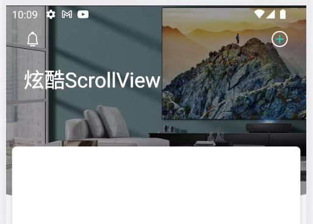
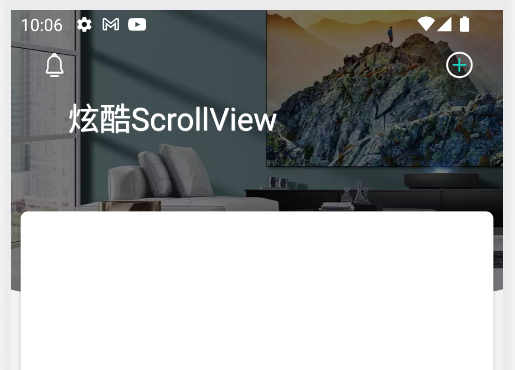
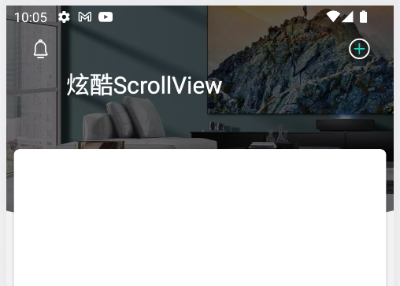
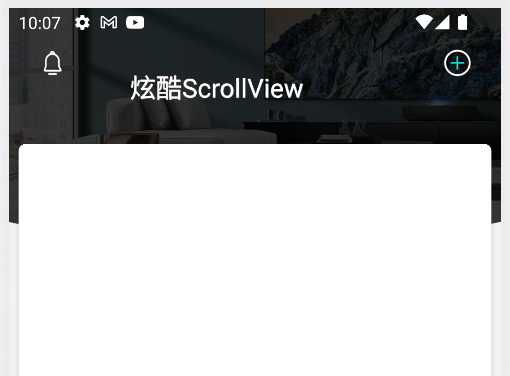
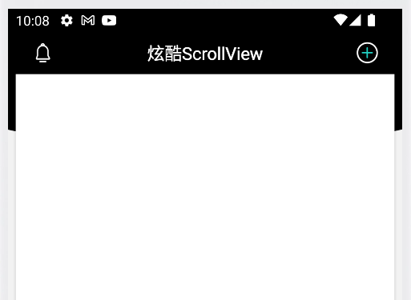

# CoolScrollViewDemo-一个炫酷的ScrollView

# 给你一个性能超高，超简单的滑动列表渐变UI思路。

## 项目演示

<div align="center">





</div>

###  核心代码

``` xml
    <!-- 给图片加个蒙版，初始化全透明(alpha="0")
     往上滑动逐渐不透明 -->
    <ImageView
        android:id="@+id/iv_home_bg_black"
        android:layout_width="match_parent"
        android:layout_height="match_parent"
        android:alpha="0"
        android:background="@drawable/ic_bg_home_black"
        tools:ignore="ContentDescription" />

    <!-- 标题栏 划到临界点变全黑 -->
    <View
        android:id="@+id/v_title_bar"
        android:layout_width="match_parent"
        android:layout_height="69dp"
        android:alpha="0"
        android:background="@color/black" />

    <!-- shadow 加粗字体-->
    <TextView
        android:id="@+id/tv_home"
        android:layout_width="wrap_content"
        android:layout_height="wrap_content"
        android:shadowColor="@color/white"
        android:shadowDx="0.8"
        android:shadowDy="0.8"
        android:shadowRadius="0.8"
        android:text="炫酷ScrollView"
        android:textColor="@color/white"
        android:textSize="28sp"
        tools:layout_marginStart="24dp"
        tools:layout_marginTop="83dp" />
```

``` kotlin
    private fun initSize() {
        statusBarHeight = ImmersionBar.getStatusBarHeight(this)
        val textMaxSize: IntArray = measureView(tv_home)
        // 得到文字宽度
        textMaxWidth = textMaxSize[0]
        // 得到文字高度
        textMAxHeight = textMaxSize[1]
        // 文字距离左侧 = 24dp
        DP24 = dp2px(this, 24)
        // 文字距离顶部 = 58dp + statusBarHeight
        DP58 = dp2px(this, 58)

        // 变化的X轴 = 屏幕宽度 / 2 - 文字宽度 / 2 - marginStart24
        textChangeX =
            getScreenWidth(this) / 2 - textMaxWidth / 2 - DP24
        // 变化的Y轴 = 高度58 - (toolbar高度22 - 文字高度) / 2
        textChangeY = DP58 - (dp2px(this, 44) - textMAxHeight) / 2
        // 每个item宽高 = (屏幕宽度 - margin8 * 3) / 2
        deviceItemSize = (getScreenWidth(this) - dp2px(this, 8 * 3)) / 2
        // 滑动变化颜色的距离 = 图片高度276 - CardView穿透上去的83 - toolbar高度44
        scrollHeight = dp2px(this, 276 - 83 - 44) - statusBarHeight
    }

    private fun initListener() {
        nsv_home.setOnScrollChangeListener { _: NestedScrollView?, _: Int, scrollY: Int, _: Int, _: Int ->
            when {
                // 在顶部
                scrollY <= 0 -> {
                    // 标题栏全透明
                    v_title_bar.alpha = 0f
                    // 图片蒙版全透明
                    iv_home_bg_black.alpha = 0f
                    // 文字大小(28sp)还原
                    tv_home.scaleX = 1f
                    tv_home.scaleY = 1f
                    // 文字x,y轴便宜
                    tv_home.x = DP24.toFloat()
                    tv_home.y = (DP58 + statusBarHeight).toFloat()
                }
                // 在scrollHeight范围内
                scrollY < scrollHeight -> {
                    // 标题栏全透明
                    v_title_bar.alpha = 0f
                    // 滑动百分比
                    val scale: Float = scrollY.toFloat() / scrollHeight
                    // 图片蒙版透明度跟随滑动变化
                    iv_home_bg_black.alpha = scale
                    // 文字大小跟随滑动变化 原始大小(28sp)到18sp之间变化
                    tv_home.scaleX = 1 - scale * (1 - SIZE18)
                    tv_home.scaleY = 1 - scale * (1 - SIZE18)
                    val changeX = (scale * textChangeX).toInt()
                    val changeY = (scale * textChangeY).toInt()
                    // 文字x,y轴偏移，原始位置到居中之间的变化
                    tv_home.x = (DP24 + changeX).toFloat()
                    tv_home.y = (DP58 + statusBarHeight - changeY).toFloat()
                }
                // 在划出scrollHeight范围
                else -> {
                    // 标题栏全黑
                    v_title_bar.alpha = 1.0f
                    // 图片蒙版全黑
                    iv_home_bg_black.alpha = 1.0f
                    // 文字大小改成18sp
                    tv_home.scaleX = SIZE18
                    tv_home.scaleY = SIZE18
                    // 文字x,y轴偏移，即居中显示
                    tv_home.x = (DP24 + textChangeX).toFloat()
                    tv_home.y = (DP58 + statusBarHeight - textChangeY).toFloat()
                }
            }
        }
    }
```
